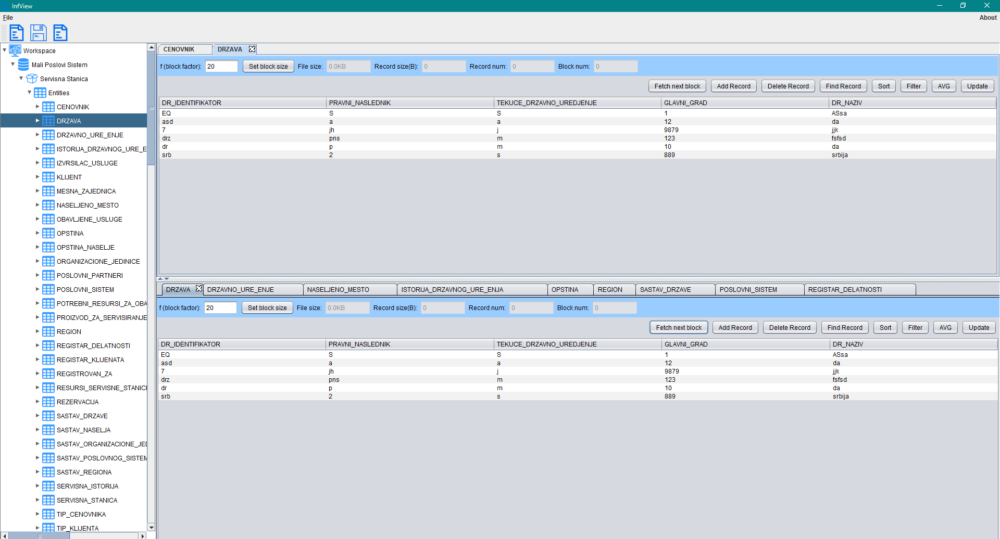

# InfView

## About
InfView is a student project from the Software Design Course on 2nd year on Racunarski Fakultet, University Union in Belgrade, Serbia.
Its purpose is to provide an abstraction with data manipulation to make data manipulation easy for ordinary/non-technical users.
It means that you can write a specification in JSON called "Meta Schema" for your Data Base and load it in and the program will parse it and setup itself according to your database.
You can load in multiple databases at the same time.

**NOTE: This is not fully functional and it works with flat file databases and SQL databases only.
I wanted to make it more modular and abstract, but I was limited by the knowledge of my team members, so I had to work with this arhitecture so they could keep up with and userstand the code.
I am planning to make a propper fully functional open source version in the near future, which will have plugins and it will support non-relational databases like the MongoDB.**

## Screenshot

